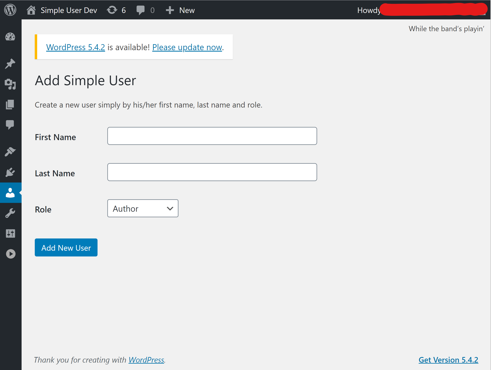

# Wordpress Simple User Plugin

Create Wordpress users simply by their names

## Usage Guide

In order to use this plugin in your Wordpress installation, download the zip package from one of the [releases](https://github.com/kanafghan/wp-simple-user/releases). From the **Plugins** page in Wordpress admin, click `Add New`. On the **Add Plugins** page, click on `Upload Plugin` and upload the downloaded zip-file. Make sure to activate the plugin after the installation. Once the plugin is activated, you can access it from the **Users** menu. Click on the `Add Simple User` submenu which should navigate you to the **Add Simple User** page looking as shown below:




## Dev Guide

In order to hack on this plugin in a very easy way, use the incluced [docker-compose](https://docs.docker.com/compose/) config, i.e. just run the following from the root folder:

```bash
$ docker-compose up -d
```

Once all the services are up, visit [http://localhost:8080](http://localhost:8080). The first time, you must go through the Wordpress installation process. Use the following links to quickly access relevant areas during development:

* [Admin Area](http://localhost:8080/wp-admin)
* [Installed Plugins](http://localhost:8080/wp-admin/plugins.php)

Other handy *docker-compose* commands are `stop` and `start` (or `restart`). Please note, that running the `down` command will also remove the volumes which means that you will have to start from scratch on a subsequent `up` execution.
